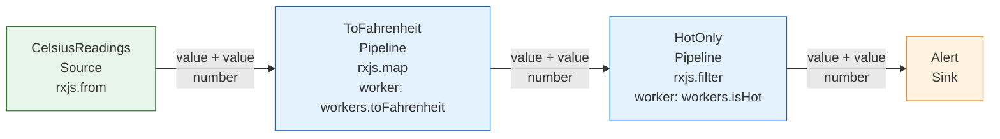
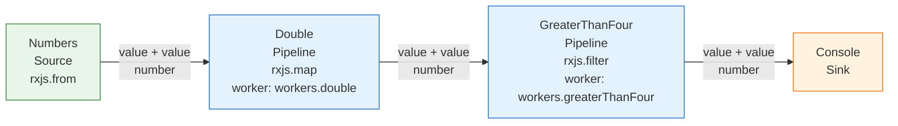

# RxJS RSL

**Reactive Specification Language (RSL)** is a readable YAML language for describing RxJS workflows.

Instead of wiring an Observable pipeline directly in TypeScript, you describe its shape as data: where values come from, how they flow through operators, and where their notifications are handled. The RSL compiler validates that description and turns it into a normal RxJS Observable.

You do not need to know AWS Step Functions or Amazon States Language to use RSL.

## Why RSL?

RxJS code is expressive, but a large pipeline can be difficult to inspect without running or reading application code. RSL gives the workflow an explicit document that tools can validate, format, visualize, test, and review.

RSL is useful when you want:

- a declarative overview of a reactive workflow;
- validation of topology, types, operations, and Worker contracts before execution;
- business functions kept separate from reactive orchestration;
- explicit concurrency, scheduling, sharing, retry, and cancellation behavior;
- deterministic YAML that is friendly to source control and tooling;
- runtime traces without changing the values flowing through the pipeline.

## The three node types

Every RSL workflow is built from three kinds of node:

| Node       | Receives values | Emits values | Purpose                                      |
| ---------- | --------------- | ------------ | -------------------------------------------- |
| `Source`   | No              | Yes          | Starts a stream, for example `from` or `of`. |
| `Pipeline` | Yes             | Yes          | Applies or coordinates RxJS operators.       |
| `Sink`     | Yes             | No           | Handles the final notifications.             |

A simple workflow looks like this:

```text
Source → Pipeline → Pipeline → Sink
```

There may be one or more Sources, zero or more Pipeline nodes, and one or more Sinks. Connections are explicit and must form a directed graph without cycles.

## Values and terminal notifications

An Observable can send zero or more values and then terminate in exactly one of two ways:

```text
next(value)* → complete()
next(value)* → error(error)
```

RSL models all three RxJS notifications:

- `Next` carries ordinary stream values.
- `Error` carries the terminal failure.
- `Complete` signals successful termination and carries no value.

A Sink can bind a named Worker to each notification:

```yaml
Handlers:
  Next: workers.render
  Error: workers.renderError
  Complete: workers.renderComplete
```

Cancellation is different from completion. Unsubscribing tears down owned work and does not call the `Complete` handler.

## A complete example

```yaml
Version: "0.1"
StartAt: Numbers
Nodes:
  Numbers:
    Type: Source
    Operation: rxjs.from
    Arguments:
      - [1, 2, 3]
    Output:
      Type: number
    Next: Double
  Double:
    Type: Pipeline
    Operation: rxjs.map
    Worker: workers.double
    Input:
      Type: number
    Output:
      Type: number
    Next: Render
  Render:
    Type: Sink
    Input:
      Type: number
    Handlers:
      Next: workers.render
      Error: workers.renderError
      Complete: workers.renderComplete
    End: true
```

This document says:

1. `Numbers` creates a stream containing `1`, `2`, and `3`.
2. `Double` applies `rxjs.map` and calls the named `workers.double` function for every value.
3. `Render` sends next, error, and complete notifications to the corresponding named Workers.

The YAML contains references such as `rxjs.map` and `workers.double`, not executable JavaScript. The application supplies their implementations through typed registries. Parsing a document can therefore never execute embedded code.

## Operators and Workers

RSL separates reactive orchestration from domain logic:

- an **operation** determines how and when values are coordinated, transformed, retried, shared, or scheduled;
- a **Worker** is a named application function that performs the actual calculation or effect.

For example, `rxjs.map` owns the one-input/one-output mapping behavior while `workers.double` only calculates the output value. Higher-order operators also own their subscription and cancellation rules; a Worker merely creates the inner Observable.

## Combining multiple Sources

Combination operators are Pipeline nodes with ordered inputs. The Sources remain independent and the combination node produces one output stream:

```yaml
SearchContext:
  Type: Pipeline
  Operation: rxjs.combineLatest
  Inputs:
    - From: Queries
      Type: string
    - From: Preferences
      Type: string
  Output:
    Type:
      kind: tuple
      items:
        - string
        - string
  Next: Search
```

This model supports operations such as `combineLatest`, `forkJoin`, `zip`, `merge`, `concat`, `withLatestFrom`, and `takeUntil`. Input order is declared explicitly when the operator depends on it.

## Higher-order concurrency

The four common flattening operators create and manage inner Observables inside a Pipeline node. RSL records their policy explicitly:

| RxJS operator | RSL policy   | Behavior                                              |
| ------------- | ------------ | ----------------------------------------------------- |
| `mergeMap`    | `Concurrent` | Runs several inner Observables concurrently.          |
| `concatMap`   | `Queue`      | Waits for each inner Observable before starting next. |
| `switchMap`   | `Latest`     | Cancels the previous inner Observable for a new one.  |
| `exhaustMap`  | `First`      | Ignores new outer values while one inner is active.   |

An `InnerSource` describes the Observable produced for each outer value. It is an execution-local template, not a fourth static node type:

```yaml
Search:
  Type: Pipeline
  Operation: rxjs.switchMap
  Worker: workers.search
  Input:
    Type: SearchRequest
  InnerSource:
    CreatedBy: Worker
    Output:
      Type: SearchResult
  Concurrency:
    Policy: Latest
    Limit: 1
  Output:
    Type: SearchResult
  Next: Render
```

## Laziness and execution

Reading, validating, resolving, compiling, formatting, and visualizing an RSL document do not run the workflow. `compileRsl()` returns a cold Observable definition. A subscription starts one execution with its own operator state, inner subscriptions, schedules, retry state, trace identity, and teardown.

```ts
import { compileRsl } from "@rxjs-rsl/core";

const workflow = compileRsl(yaml, applicationRegistries);

// Nothing has executed yet.
const subscription = workflow.definition.subscribe();

// Cancellation tears down work owned by this execution.
subscription.unsubscribe();
```

Sharing is never inferred merely because a node has several downstream consumers. Cold behavior remains the default unless the document declares a sharing operation and its reset policy.

## Errors, retry, and recovery

Errors are terminal notifications unless an operation handles them. RSL supports bounded retry policies, scheduler-controlled backoff, and `catchError` recovery through a named Observable-producing Worker. Cancellation also owns pending retry timers, so unsubscribing prevents later retries or recovery work.

## Scheduling, tracing, and visualization

Scheduler references make operation timing, subscription timing, and notification delivery explicit. Virtual schedulers can provide deterministic tests, including stable ordering when actions have the same logical time.

Optional tracing records execution lifecycle, node subscriptions, notifications, scheduling roles, retries, recoveries, completion, errors, cancellation, and teardown. Trace observers are isolated and cannot alter workflow behavior.

RSL graphs can also be rendered as deterministic Mermaid diagrams without resolving or executing runtime capabilities.

## Developer workflow

The project currently builds from this repository; npm publication is intentionally deferred.

```bash
npm install
npm run check
npm run rsl -- validate path/to/workflow.rsl.yaml
npm run rsl -- format path/to/workflow.rsl.yaml --check
npm run rsl -- visualize path/to/workflow.rsl.yaml
npm run rsl -- inspect path/to/workflow.rsl.yaml
npm run rsl -- debug path/to/trace.json
```

The CLI never subscribes to a workflow. `format --write` and `visualize --output` are the only file-writing modes.

## Runnable example

The [temperature alerts example](examples/temperature-alerts/README.md) walks through one complete path:



The diagram is generated from [`workflow.rsl.yaml`](examples/temperature-alerts/workflow.rsl.yaml); its exact CLI output is checked in as [`workflow.mmd`](examples/temperature-alerts/workflow.mmd) and protected by a snapshot test.

1. describe a Source → map → filter → Sink workflow in RSL;
2. bind the named operations and Workers and compile it to a cold RxJS Observable;
3. subscribe and observe its output;
4. compare it with equivalent handwritten RxJS;
5. generate and render its Mermaid graph.

```bash
npm run example:temperature
```

### Double and filter

The [double-and-filter example](examples/double-and-filter/README.md) visualizes `from([1, 2, 3, 4, 5]).pipe(map(n => n * 2), filter(n => n > 4))`:



## RSL v0.1 status

**RSL 19 — v0.1 conformant**

The `compileRsl` boundary composes deterministic parsing, structural validation, reference resolution, semantic validation, and lazy graph compilation. The release gate verifies the complete path, runtime traces, deterministic projections, stage-specific diagnostics, the built package API, and every non-excluded row of the conformance matrix.

RxJS 7.8.2 is pinned for RSL v0.1. The package version is `0.1.0`.

## Documentation

- [RSL Specification v0.1](docs/RSL-Specification-v0.1.md)
- [v0.1 release conformance](docs/release-conformance.md)
- [CLI and developer workflow](docs/cli-and-developer-workflow.md)
- [Visualization and debugging](docs/visualization-and-debugging.md)
- [Error, retry, and recovery](docs/error-retry-and-recovery.md)
- [Execution lifecycle and tracing](docs/execution-lifecycle-and-tracing.md)
- [Scheduler and time runtime](docs/scheduler-and-time-runtime.md)
- [Higher-order policies](docs/higher-order-policies.md)
- [Multi-input, branching, and sharing](docs/multi-input-branching-sharing.md)
- [Type and operation contracts](docs/type-and-operation-contracts.md)
- [Registries and resolution](docs/registries-and-resolution.md)
- [Structural validator](docs/structural-validator.md)
- [Deterministic YAML](docs/deterministic-yaml.md)
- [Normalized model](docs/normalized-model.md)
- [Architecture boundaries](docs/architecture.md)
- [Conformance matrix](docs/conformance-matrix.md)

## Completed milestone sequence

| Milestone | Deliverable                                  |
| --------- | -------------------------------------------- |
| RSL 05    | Repository and conformance scaffold          |
| RSL 06    | Normalized TypeScript model                  |
| RSL 07    | Deterministic YAML parser and serializer     |
| RSL 08    | Structural validator                         |
| RSL 09    | Registries and reference resolution          |
| RSL 10    | Type and operation-contract validator        |
| RSL 11    | Unary RxJS compiler and first vertical slice |
| RSL 12    | Multi-input, branching, and sharing          |
| RSL 13    | Higher-order operation policies              |
| RSL 14    | Scheduler and time runtime                   |
| RSL 15    | Execution lifecycle and tracing              |
| RSL 16    | Error, retry, and recovery semantics         |
| RSL 17    | Visualization and debugging                  |
| RSL 18    | CLI and developer workflow                   |
| RSL 19    | End-to-end conformance and v0.1 release      |
