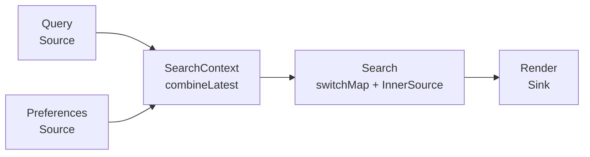

# Reactive Specification Language (RSL) Specification v0.1

## Status

This document consolidates the following RSL v0.1 definitions into one coherent specification:

1. ASL-inspired core syntax;
2. the RxJS notification protocol;
3. multi-source combination;
4. dynamic inner sources and concurrency policies.

The terms **MUST**, **MUST NOT**, **SHOULD**, **SHOULD NOT**, and **MAY** are normative requirements.

## 1. Purpose

The Reactive Specification Language (RSL) is a deterministic YAML language for describing an RxJS workflow as a lazy, typed, directed acyclic dataflow graph.

RSL separates three concerns:

- **Structure** declares what is connected.
- **Operations** declare how notifications participate in the workflow.
- **Workers** declare named domain functions that perform business computation.

An RSL document is a workflow definition. Nothing runs merely because the document exists. Subscription starts one workflow execution and returns a cancellation handle.

## 2. ASL inspiration

RSL borrows a small structural vocabulary from the Amazon States Language:

- a workflow has one or more named entry nodes;
- nodes are declared in a named mapping;
- every node declares its `Type`;
- `Next` connects nodes;
- `End: true` marks a structurally terminal node.

RSL does not copy ASL's state model. ASL describes state transitions; RSL describes typed RxJS notifications moving through a lazy dataflow over time.

| ASL concept              | RSL counterpart                                        |
| ------------------------ | ------------------------------------------------------ |
| State-machine definition | Lazy RxJS workflow definition                          |
| State name               | Node name                                              |
| `StartAt`                | One Source name or an ordered sequence of Source names |
| `States`                 | `Nodes`                                                |
| State `Type`             | `Source`, `Pipeline`, or `Sink`                        |
| `Resource`               | `Operation` or `Worker` reference                      |
| `Next`                   | Directed dataflow connection                           |
| `End: true`              | Structurally terminal Sink                             |
| State-machine execution  | Workflow execution started by subscription             |
| Execution handle         | RxJS `Subscription`                                    |

## 3. Core model

RSL has exactly three core node types.

### 3.1 Source

A Source has no input and one output. It produces notifications after subscription.

```text
no input → Source → output
```

### 3.2 Pipeline

A Pipeline has one or more inputs and one output. Its operation controls how notifications participate; its optional Worker performs domain computation.

```text
input(s) → Pipeline → output
```

A Pipeline may be:

- unary, such as `map` or `filter`;
- multi-input, such as `combineLatest` or `forkJoin`;
- dynamically flattening, such as `mergeMap`, `concatMap`, `switchMap`, or `exhaustMap`.

### 3.3 Sink

A Sink has one input and no output. It consumes notifications through Observer handlers.

```text
input → Sink → no output
```

### 3.4 No additional core types

Multi-input coordination and dynamic inner Observables do not introduce new core node types:

- a combination operation is a multi-input Pipeline;
- an inner Observable is represented by an `InnerSource` template nested inside a flattening Pipeline.

## 4. Document structure

```yaml
Version: "0.1"
Comment: Optional human-readable description
StartAt: SourceNode
Nodes:
  SourceNode:
    Type: Source
    Operation: rxjs.of
    Arguments:
      - 1
    Output:
      Type: number
    Next: PipelineNode

  PipelineNode:
    Type: Pipeline
    Operation: rxjs.map
    Worker: domain.double
    Input:
      Type: number
    Output:
      Type: number
    Next: SinkNode

  SinkNode:
    Type: Sink
    Input:
      Type: number
    Handlers:
      Next: ui.renderValue
      Error: ui.renderError
      Complete: ui.renderComplete
    End: true
```

### 4.1 Top-level fields

| Field     | Requirement | Meaning                                                 |
| --------- | ----------- | ------------------------------------------------------- |
| `Version` | Required    | RSL syntax version.                                     |
| `Comment` | Optional    | Human-readable text with no execution semantics.        |
| `StartAt` | Required    | One Source name or an ordered sequence of Source names. |
| `Nodes`   | Required    | Mapping from unique node names to node definitions.     |

For one root Source:

```yaml
StartAt: Numbers
```

For multiple root Sources:

```yaml
StartAt:
  - User
  - Preferences
```

The order of multiple entries establishes stable subscription order where an operation and scheduler make that order observable.

## 5. Field vocabulary

| Field         | Meaning                                                   |
| ------------- | --------------------------------------------------------- |
| `Type`        | One of `Source`, `Pipeline`, or `Sink`.                   |
| `Operation`   | Resolvable RxJS source or operator reference.             |
| `Worker`      | Resolvable named domain-function reference.               |
| `Arguments`   | Deterministic arguments supplied to an operation.         |
| `Input`       | Unary input notification port.                            |
| `Inputs`      | Ordered set of input bindings for a multi-input Pipeline. |
| `Output`      | Output notification port.                                 |
| `InnerSource` | Template for execution-local inner Observables.           |
| `Concurrency` | Admission and lifecycle policy for inner subscriptions.   |
| `Handlers`    | Sink Observer-handler references.                         |
| `Next`        | Name of the downstream node.                              |
| `End`         | Declares that a Sink has no downstream node.              |

## 6. Node syntax and invariants

### 6.1 Source node

```yaml
Numbers:
  Type: Source
  Operation: rxjs.from
  Arguments:
    - [1, 2, 3]
  Output:
    Type: number
  Next: Double
```

A Source:

1. MUST declare `Type: Source`.
2. MUST NOT declare `Input` or `Inputs`.
3. MUST declare exactly one `Output`.
4. MUST declare a resolvable source `Operation`.
5. MAY declare deterministic `Arguments`.
6. MUST declare `Next` in this core syntax.
7. MUST remain lazy until workflow subscription.

### 6.2 Unary Pipeline node

```yaml
Double:
  Type: Pipeline
  Operation: rxjs.map
  Worker: domain.double
  Input:
    Type: number
  Output:
    Type: number
  Next: Render
```

A unary Pipeline:

1. MUST declare `Type: Pipeline`.
2. MUST declare exactly one `Input`.
3. MUST NOT declare `Inputs`.
4. MUST declare exactly one `Output`.
5. MUST declare a resolvable RxJS `Operation`.
6. MUST declare `Next`.
7. MAY declare a named `Worker` when the operation invokes domain behavior.
8. MAY declare deterministic `Arguments` for operation parameters.

The operation is the orchestrator. The Worker is the business function.

### 6.3 Multi-input Pipeline node

```yaml
CombineContext:
  Type: Pipeline
  Operation: rxjs.combineLatest
  Inputs:
    - From: User
      Type: User
    - From: Preferences
      Type: Preferences
  Output:
    Type: "readonly [User, Preferences]"
  Next: BuildViewModel
```

A multi-input Pipeline:

1. MUST declare `Type: Pipeline`.
2. MUST declare two or more ordered `Inputs`.
3. MUST NOT declare singular `Input`.
4. MUST declare exactly one `Output`.
5. MUST declare a multi-input coordination `Operation`.
6. MUST declare `Next`.

Each input binding contains:

| Field  | Meaning                    |
| ------ | -------------------------- |
| `From` | Name of the upstream node. |
| `Type` | Type of its `next` values. |

For sequence-based combination, input order determines output tuple position.

### 6.4 Flattening Pipeline node

```yaml
Search:
  Type: Pipeline
  Operation: rxjs.switchMap
  Worker: api.search
  Input:
    Type: SearchQuery
  InnerSource:
    CreatedBy: Worker
    Output:
      Type: SearchResult
  Concurrency:
    Policy: Latest
    Limit: 1
  Output:
    Type: SearchResult
  Next: RenderResults
```

A flattening Pipeline:

1. MUST declare one outer `Input` and one flattened `Output`.
2. MUST reference an Observable-producing Worker.
3. MUST declare one `InnerSource` template, either explicitly or by deterministic expansion.
4. MUST declare a valid `Concurrency` policy, either explicitly or by deterministic expansion.
5. MUST declare `Next`.

### 6.5 Sink node

```yaml
Render:
  Type: Sink
  Input:
    Type: number
  Handlers:
    Next: ui.renderValue
    Error: ui.renderError
    Complete: ui.renderComplete
  End: true
```

A Sink:

1. MUST declare `Type: Sink`.
2. MUST declare exactly one `Input`.
3. MUST NOT declare `Output`, `Next`, or `Operation`.
4. MUST declare `End: true`.
5. SHOULD explicitly declare all three `Handlers`.

## 7. Notification protocol

Every RSL connection carries the complete RxJS notification protocol:

```text
next(value)* → complete()
next(value)* → error(error)
```

For one workflow execution:

1. zero or more `next(value)` notifications MAY occur;
2. at most one terminal notification may occur: `complete()` or `error(error)`;
3. `complete()` and `error(error)` are mutually exclusive;
4. no notification may occur after a terminal notification;
5. cancellation is not a notification and produces neither `complete()` nor `error()`.

Conceptually:

```ts
type Notification<T, E = unknown> =
  | { kind: "next"; value: T }
  | { kind: "error"; error: E }
  | { kind: "complete" };
```

These are protocol alternatives, not domain values. They become values only when an explicit `rxjs.materialize` operation is used.

### 7.1 Expanded port form

```yaml
Output:
  Next:
    Type: number
  Error:
    Type: unknown
  Complete: true
```

| Declaration      | Meaning                                           |
| ---------------- | ------------------------------------------------- |
| `Next.Type`      | Type carried by `next(value)`.                    |
| `Error.Type`     | Type carried by `error(error)`.                   |
| `Complete: true` | Port accepts or produces payload-free completion. |

`unknown` is the default error type because RxJS 7 does not enforce a typed error channel.

### 7.2 Compact port form

```yaml
Output:
  Type: number
```

This expands deterministically to:

```yaml
Output:
  Next:
    Type: number
  Error:
    Type: unknown
  Complete: true
```

The same expansion applies to `Input.Type` and `Inputs[].Type`.

### 7.3 Default Pipeline propagation

Ordinary operations such as `map` and `filter` behave as follows:

| Incoming notification | Default behavior                                           |
| --------------------- | ---------------------------------------------------------- |
| `next(value)`         | Apply the operation and invoke its Worker as defined.      |
| `error(error)`        | Forward the error without invoking the next-value Worker.  |
| `complete()`          | Forward completion without invoking the next-value Worker. |

Operations such as `catchError`, `retry`, `materialize`, `dematerialize`, `take`, flattening operators, and combination operators override parts of this default policy.

### 7.4 Sink handlers

```yaml
Handlers:
  Next: ui.renderValue
  Error: ui.renderError
  Complete: ui.renderComplete
```

- `Next` receives the value carried by `next(value)`.
- `Error` receives the error carried by `error(error)`.
- `Complete` is invoked with no argument.

### 7.5 Structural termination versus runtime termination

| Concept        | Meaning                                   |
| -------------- | ----------------------------------------- |
| `End: true`    | The Sink has no downstream node.          |
| `complete()`   | This execution terminated successfully.   |
| `error(error)` | This execution terminated unsuccessfully. |
| cancellation   | The Subscription stopped the execution.   |

A Sink may be structurally terminal even when its execution never receives `complete()`, as with `NEVER` or a long-lived event source.

## 8. Multi-source combination

RSL represents combination as:

```text
many Source nodes → one multi-input Pipeline → one combined output → downstream Pipeline → Sink
```

The combination Pipeline becomes the effective source of the downstream linear pipeline, but it remains structurally a Pipeline because it has inputs.

### 8.1 Complete `combineLatest` example

```yaml
Version: "0.1"
StartAt:
  - User
  - Preferences

Nodes:
  User:
    Type: Source
    Operation: app.userChanges
    Output:
      Type: User
    Next: CombineUserContext

  Preferences:
    Type: Source
    Operation: app.preferenceChanges
    Output:
      Type: Preferences
    Next: CombineUserContext

  CombineUserContext:
    Type: Pipeline
    Operation: rxjs.combineLatest
    Inputs:
      - From: User
        Type: User
      - From: Preferences
        Type: Preferences
    Output:
      Type: "readonly [User, Preferences]"
    Next: BuildViewModel

  BuildViewModel:
    Type: Pipeline
    Operation: rxjs.map
    Worker: domain.buildUserViewModel
    Input:
      Type: "readonly [User, Preferences]"
    Output:
      Type: UserViewModel
    Next: Render

  Render:
    Type: Sink
    Input:
      Type: UserViewModel
    Handlers:
      Next: ui.renderUser
      Error: ui.renderError
      Complete: ui.renderComplete
    End: true
```

Equivalent RxJS:

```ts
const workflow$ = combineLatest([userChanges$, preferenceChanges$]).pipe(
  map(buildUserViewModel),
);

const execution = workflow$.subscribe({
  next: renderUser,
  error: renderError,
  complete: renderComplete,
});
```

### 8.2 `combineLatest` policy

For its ordered inputs, `combineLatest`:

1. subscribes to all inputs when execution starts;
2. remembers the most recent next-value from each input;
3. emits nothing until every input has emitted at least once;
4. then emits a new tuple whenever any input emits;
5. preserves the declared input order in every tuple;
6. errors immediately if any input errors and cancels the other inputs;
7. completes after all inputs complete;
8. cannot emit a tuple if any input completes without first emitting.

### 8.3 `forkJoin` policy

`forkJoin` uses the same graph shape but a different operation:

```yaml
LoadAccount:
  Type: Pipeline
  Operation: rxjs.forkJoin
  Inputs:
    - From: LoadUser
      Type: User
    - From: LoadOrders
      Type: "readonly Order[]"
  Output:
    Type: "readonly [User, readonly Order[]]"
  Next: BuildAccount
```

For its ordered inputs, `forkJoin`:

1. subscribes to all inputs when execution starts;
2. remembers the latest value from every input;
3. emits nothing while any required input is incomplete;
4. emits one tuple after all inputs complete successfully with values;
5. completes immediately after that tuple;
6. errors immediately if any input errors and cancels the others;
7. completes without a tuple if an input completes without emitting;
8. cannot emit while an input remains incomplete forever.

### 8.4 Connection consistency

The upstream node's `Next` and the combination node's `Inputs[].From` are two views of the same connection and MUST agree.

For every binding:

1. `From` MUST resolve to a node with an output.
2. The upstream `Output.Next.Type` MUST be assignable to the bound input `Next.Type`.
3. Every incoming `Next` MUST have one matching binding.
4. Every binding MUST have one corresponding incoming connection.

## 9. Dynamic inner sources

The flattening operations share one mechanism:

```text
outer next(value)
  → Observable-producing Worker
  → dynamic inner Observable
  → concurrency policy
  → flattened output
```

The Worker contract is:

```ts
(outerValue: A) => Observable<B>;
```

The complete Pipeline contract is:

```ts
Observable<A> => Observable<B>
```

### 9.1 Static template and runtime instances

The static definition contains one nested template:

```yaml
InnerSource:
  CreatedBy: Worker
  Output:
    Type: SearchResult
```

One execution may create runtime instances such as:

```text
Search.InnerSource[0]
Search.InnerSource[1]
Search.InnerSource[2]
```

These are execution-local trace identities, not permanent RSL node names. Each should be traceable to its parent Pipeline, outer notification, Worker invocation, inner subscription, subscription time, and terminal or cancellation outcome.

## 10. Concurrency policies

| Operation    | Policy       | New outer value while busy                            |
| ------------ | ------------ | ----------------------------------------------------- |
| `mergeMap`   | `Concurrent` | Start another inner source, subject to the limit.     |
| `concatMap`  | `Queue`      | Retain the value and run it later.                    |
| `switchMap`  | `Latest`     | Cancel the active inner source and start the new one. |
| `exhaustMap` | `First`      | Ignore the new value.                                 |

### 10.1 `mergeMap`: allow overlap

```yaml
LoadDetails:
  Type: Pipeline
  Operation: rxjs.mergeMap
  Worker: api.loadDetails
  Input:
    Type: ItemId
  InnerSource:
    CreatedBy: Worker
    Output:
      Type: ItemDetails
  Concurrency:
    Policy: Concurrent
    Limit: Unbounded
  Output:
    Type: ItemDetails
  Next: RenderDetails
```

`mergeMap` accepts every outer value, starts inner work while capacity exists, permits overlap, and merges inner notifications in occurrence order. It does not guarantee outer-input output order. An integer limit MAY replace `Unbounded`; excess outer values wait for capacity.

### 10.2 `concatMap`: queue

```yaml
SaveChanges:
  Type: Pipeline
  Operation: rxjs.concatMap
  Worker: api.saveChange
  Input:
    Type: Change
  InnerSource:
    CreatedBy: Worker
    Output:
      Type: SaveResult
  Concurrency:
    Policy: Queue
    Limit: 1
  Output:
    Type: SaveResult
  Next: RenderSaveResult
```

`concatMap` permits one active inner subscription, queues later outer values, and starts queued work in arrival order after the active inner completes.

### 10.3 `switchMap`: only latest

```yaml
Search:
  Type: Pipeline
  Operation: rxjs.switchMap
  Worker: api.search
  Input:
    Type: SearchQuery
  InnerSource:
    CreatedBy: Worker
    Output:
      Type: SearchResult
  Concurrency:
    Policy: Latest
    Limit: 1
  Output:
    Type: SearchResult
  Next: RenderResults
```

`switchMap` cancels the active inner subscription when a new outer value arrives, then invokes the Worker for the new value and subscribes to the latest inner Observable. Cancelling the previous inner is not completion.

### 10.4 `exhaustMap`: ignore while busy

```yaml
SubmitOrder:
  Type: Pipeline
  Operation: rxjs.exhaustMap
  Worker: api.submitOrder
  Input:
    Type: Order
  InnerSource:
    CreatedBy: Worker
    Output:
      Type: OrderReceipt
  Concurrency:
    Policy: First
    Limit: 1
  Output:
    Type: OrderReceipt
  Next: RenderReceipt
```

`exhaustMap` accepts an outer value only when no inner subscription is active. Values arriving while busy are ignored, not queued, and their Workers are not invoked.

### 10.5 Deterministic policy expansion

Because each operation determines its standard policy, this compact form is valid:

```yaml
Search:
  Type: Pipeline
  Operation: rxjs.switchMap
  Worker: api.search
  Input:
    Type: SearchQuery
  InnerSource:
    Output:
      Type: SearchResult
  Output:
    Type: SearchResult
  Next: RenderResults
```

It expands to:

```yaml
InnerSource:
  CreatedBy: Worker
  Output:
    Type: SearchResult
Concurrency:
  Policy: Latest
  Limit: 1
```

The explicit form is preferred for teaching, validation, visualization, and tracing. The compact form is suitable for ordinary authoring.

## 11. Flattening notification semantics

### 11.1 Outer next

For each outer `next(value)`, the operation applies its concurrency policy. The potential work is started, queued, used to replace current work, or ignored. Worker invocation timing follows the chosen operation.

If an invoked Worker throws, the exception becomes the Pipeline output error.

### 11.2 Inner next

An accepted active inner source's `next(value)` becomes the flattening Pipeline's output `next(value)`.

### 11.3 Inner error

Unless explicitly recovered:

- the inner error becomes the Pipeline output error;
- the outer subscription is cancelled;
- all other active inner subscriptions are cancelled;
- queued values are discarded;
- no later notification is emitted.

### 11.4 Inner complete

Inner completion closes that inner subscription only. It may release capacity, start queued work, or make the Pipeline eligible for final completion.

### 11.5 Outer error

An outer error becomes the Pipeline output error and cancels all active inner subscriptions.

### 11.6 Outer complete

Outer completion prevents new outer work but normally does not cancel accepted inner work:

| Operation    | Behavior after outer completion                 |
| ------------ | ----------------------------------------------- |
| `mergeMap`   | Wait for all active and admitted inner work.    |
| `concatMap`  | Drain the active inner and queued outer values. |
| `switchMap`  | Wait for the latest active inner.               |
| `exhaustMap` | Wait for the accepted active inner.             |

The Pipeline completes only when the outer source is complete and no accepted inner work remains.

## 12. Error handling

Errors remain terminal unless an explicit operation intercepts them.

### 12.1 Recover with another Observable

```yaml
Recover:
  Type: Pipeline
  Operation: rxjs.catchError
  Worker: domain.recoverNumbers
  Input:
    Type: number
  Output:
    Type: number
  Next: Render
```

The Worker is Observable-producing. `catchError` replaces the failed upstream execution with the returned Observable, which may emit next-values and then complete or error.

### 12.2 Retry

```yaml
RetryRequest:
  Type: Pipeline
  Operation: rxjs.retry
  Arguments:
    Count: 3
  Input:
    Type: ApiResponse
  Output:
    Type: ApiResponse
  Next: Render
```

`retry` handles an upstream error by resubscribing according to its policy. Only an unrecovered final error flows downstream.

## 13. Completion-changing operations

Completion is governed by operation semantics:

- `map` forwards completion after its source completes;
- `take(3)` completes after the third accepted value and cancels upstream;
- `mergeMap` waits for the outer source and all accepted active inners;
- `concatMap` waits for the outer source, active inner, and queued work;
- `switchMap` waits for the outer source and current latest inner;
- `exhaustMap` waits for the outer source and current accepted inner;
- `combineLatest` applies its multi-input completion policy;
- `forkJoin` requires final values and completion from all inputs;
- `NEVER` emits neither next, error, nor complete.

## 14. Cancellation

Cancelling the workflow through its Subscription:

- tears down the root Source subscriptions;
- cancels active inner subscriptions;
- discards queued outer values;
- prevents future Worker invocations;
- emits neither `complete()` nor `error()`.

Cancellation MUST NOT be represented as completion.

## 15. Type compatibility

For a connection from node `A` to node `B`:

1. `A.Output.Next.Type` MUST be assignable to the bound `B` input's `Next.Type`.
2. `A.Output.Error.Type` SHOULD be assignable to the bound input's `Error.Type`.
3. If `A.Output.Complete` is true, the bound input MUST accept completion.
4. A flattening Worker's return type MUST be compatible with `Observable<InnerSource.Output.Next.Type>`.
5. A flattening `InnerSource.Output.Next.Type` MUST be assignable to its parent Pipeline `Output.Next.Type`.
6. A multi-input output type MUST be compatible with the ordered input types and operation definition.

## 16. Graph invariants

A well-formed RSL v0.1 graph MUST satisfy all of the following:

1. Every `StartAt` entry resolves to a declared Source.
2. Every Source is reachable from `StartAt`.
3. Every `Next` resolves to a declared node.
4. Every declared node is reachable from at least one entry Source.
5. The graph contains at least one Source and at least one Sink.
6. Every Source has no inputs and exactly one output.
7. Every Pipeline has one or more inputs and exactly one output.
8. Every Sink has exactly one input and no output.
9. Every Sink declares `End: true` and no `Next`.
10. Every non-Sink node declares `Next` in this core syntax.
11. The graph is acyclic.
12. Connected ports satisfy notification type compatibility.
13. Operation and Worker references resolve before execution begins.
14. Domain behavior uses named Worker references rather than inline anonymous functions.
15. A multi-input `Inputs[].From` set agrees with incoming `Next` connections.
16. A flattening operation has a valid `InnerSource` template and concurrency policy.
17. Runtime inner-source instances are local to one workflow execution.

## 17. Execution invariants

For each subscription:

1. exactly one workflow execution begins;
2. root Sources are subscribed according to the graph and scheduling semantics;
3. notifications follow the RxJS next/error/complete protocol;
4. Workers are invoked only according to their operation's policy;
5. errors and completion follow the operation-specific propagation rules;
6. teardown occurs after terminal notification or cancellation as required;
7. a new subscription creates an independent execution unless sharing is explicitly declared elsewhere;
8. cancellation affects only the execution owned by the cancelled Subscription unless sharing semantics explicitly say otherwise.

## 18. Complete example with combination and flattening

```yaml
Version: "0.1"
Comment: Search using the latest query and current user preferences

StartAt:
  - Query
  - Preferences

Nodes:
  Query:
    Type: Source
    Operation: ui.searchQueryChanges
    Output:
      Type: SearchQuery
    Next: SearchContext

  Preferences:
    Type: Source
    Operation: app.preferenceChanges
    Output:
      Type: Preferences
    Next: SearchContext

  SearchContext:
    Type: Pipeline
    Operation: rxjs.combineLatest
    Inputs:
      - From: Query
        Type: SearchQuery
      - From: Preferences
        Type: Preferences
    Output:
      Type: "readonly [SearchQuery, Preferences]"
    Next: Search

  Search:
    Type: Pipeline
    Operation: rxjs.switchMap
    Worker: api.searchWithPreferences
    Input:
      Type: "readonly [SearchQuery, Preferences]"
    InnerSource:
      CreatedBy: Worker
      Output:
        Type: SearchResult
    Concurrency:
      Policy: Latest
      Limit: 1
    Output:
      Type: SearchResult
    Next: Render

  Render:
    Type: Sink
    Input:
      Type: SearchResult
    Handlers:
      Next: ui.renderSearchResult
      Error: ui.renderSearchError
      Complete: ui.renderSearchComplete
    End: true
```

Equivalent RxJS:

```ts
const workflow$ = combineLatest([searchQueryChanges$, preferenceChanges$]).pipe(
  switchMap(searchWithPreferences),
);

const execution = workflow$.subscribe({
  next: renderSearchResult,
  error: renderSearchError,
  complete: renderSearchComplete,
});
```



## 19. Compact grammar

```text
Workflow          ::= Version Comment? StartAt Nodes
StartAt           ::= SourceName | SourceNameSequence
Nodes             ::= Node+
Node              ::= SourceNode | PipelineNode | SinkNode
SourceNode        ::= Name Type(Source) Operation Arguments? Output Next
PipelineNode      ::= UnaryPipeline | MultiInputPipeline | FlatteningPipeline
UnaryPipeline     ::= Name Type(Pipeline) Operation Worker? Arguments? Input Output Next
MultiInputPipeline ::= Name Type(Pipeline) Operation Inputs Output Next
FlatteningPipeline ::= Name Type(Pipeline) FlattenOperation Worker Input InnerSource Concurrency? Output Next
SinkNode          ::= Name Type(Sink) Input Handlers End(true)
Port              ::= CompactPort | NotificationPort
CompactPort       ::= Type
NotificationPort  ::= Next Error Complete
InputBinding      ::= From Port
InnerSource       ::= CreatedBy(Worker)? Output
```

## 20. Summary model

```text
Static workflow:
Source node(s) → Pipeline node(s) → Sink node(s)

Runtime protocol:
next(value)* → complete()
next(value)* → error(error)

Dynamic flattening:
outer next(value) → Worker → inner Observable → concurrency policy → output

Lifecycle:
subscription → execution → terminal notification or cancellation → teardown
```

The Source–Pipeline–Sink model remains stable across linear workflows, multi-source coordination, and dynamically created inner Observables. The topology changes; the three core node types do not.
