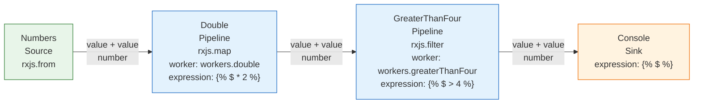
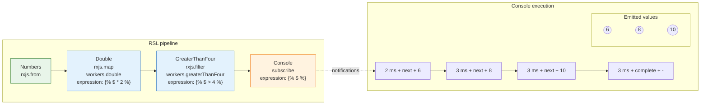

# Double and filter visualization

This RSL graph represents the following RxJS pipeline:

```ts
from([1, 2, 3, 4, 5])
  .pipe(
    map((n) => n * 2),
    filter((n) => n > 4),
  )
  .subscribe((n) => console.log(n));
```

RSL replaces the inline callbacks with the named Workers `workers.double`, `workers.greaterThanFour`, and `workers.log`. The resulting values are `6`, `8`, and `10`.

The `x-jsonata` metadata records a declarative expression for visualization while the registered Worker remains the executable implementation:

```yaml
x-jsonata: ""
```

Generate the diagram from [`workflow.rsl.yaml`](workflow.rsl.yaml):

```bash
npm run rsl -- visualize examples/double-and-filter/workflow.rsl.yaml --output examples/double-and-filter/workflow.mmd
```

The generated [`workflow.mmd`](workflow.mmd) renders as:



## Execution timeline

The saved [`trace.json`](trace.json) adds values, logical time, and terminal notifications to the graph:

```bash
npm run rsl -- visualize examples/double-and-filter/workflow.rsl.yaml --trace examples/double-and-filter/trace.json --node Console --output examples/double-and-filter/execution-timeline.mmd
```

[`execution-timeline.mmd`](execution-timeline.mmd) renders as:


