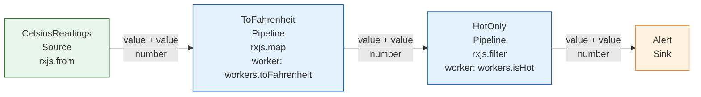

# Temperature alerts example

This example converts Celsius readings to Fahrenheit, keeps readings at or above 80 °F, prints each hot reading, and handles error and complete notifications.

## 1. Describe the workflow with RSL

[`workflow.rsl.yaml`](workflow.rsl.yaml) declares this graph:

```text
Celsius readings → map to Fahrenheit → filter hot readings → alert Sink
```

The document contains only data and named references. It contains no executable functions.

## 2. Compile and run it as RxJS

[`run.ts`](run.ts) supplies the RxJS operations and application Workers through typed registries, then calls:

```ts
const workflow = compileRsl(yaml, registries);
workflow.definition.subscribe();
```

`compileRsl` creates a cold RxJS Observable; it does not emit TypeScript source code and does not execute the pipeline. Subscription starts the execution.

Run it from the repository root:

```bash
npm run example:temperature
```

Expected output:

```text
RSL compiled to a cold RxJS Observable; subscribing now.
Hot: 80.6 °F
Hot: 87.8 °F
Temperature stream complete
```

[`equivalent-rxjs.ts`](equivalent-rxjs.ts) shows the small handwritten RxJS expression with the same behavior. It makes the runtime result of RSL compilation easy to compare with familiar RxJS code.

## 3. Generate the Mermaid graph

```bash
npm run rsl -- visualize examples/temperature-alerts/workflow.rsl.yaml --output examples/temperature-alerts/workflow.mmd
```

The checked-in [`workflow.mmd`](workflow.mmd) is generated by that command. GitHub and other Mermaid-aware Markdown renderers can display it directly:


